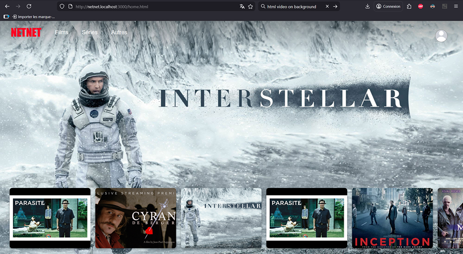
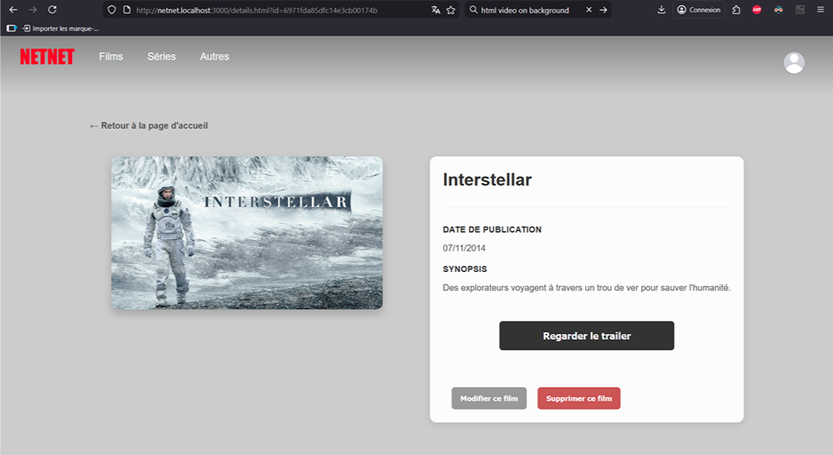
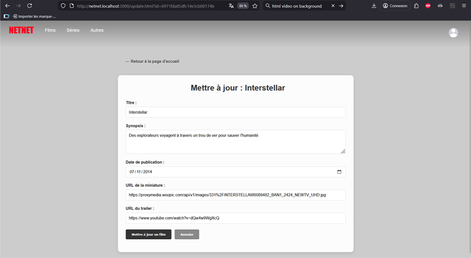
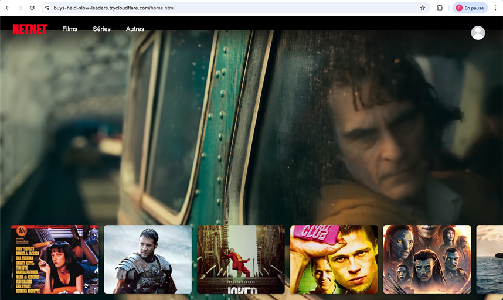
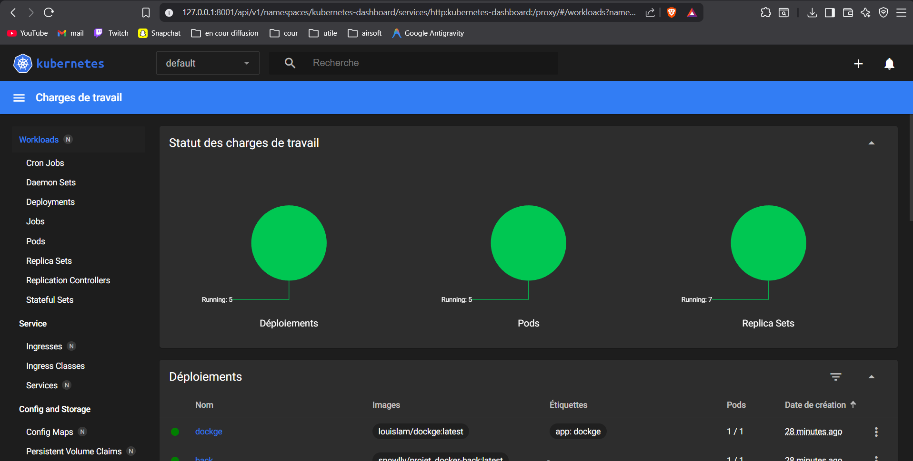
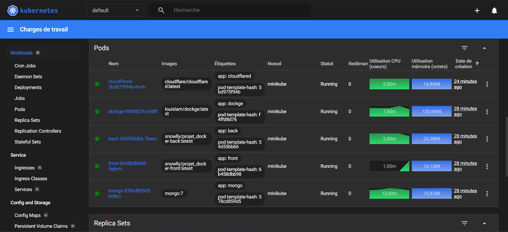

# Site bande-annonce film

> **MEMBRES DU GROUPE :**
> - **BLAIN Antoine**
> - **PECONTAL Corentin** 
> - **MARTIN Evan**

---

## 1. Présentation du Projet
Dans ce projet, nous allons créer un site très basique dédié aux bandes-annonces de films. L’objectif principal est de mettre en place un CRUD (Créer, Lire, Mettre à jour, Supprimer) pour gérer facilement les films et leurs bandes-annonces.

**Fonctionnalités principales :**
* Afficher des trailers (Image Thumbnail, Titre, Date de publication, Synopsis, Bouton regarder avec le lien YT)
* Ajouter des trailers
* Modifier les trailers
* Suppression des trailers en cascade 

**Technologies utilisées :**
* NodeJS 
* Google Doc 
* MongoDB
* Discord 
* GitHub et Git
* Caddy 
* Dockge
* Cloudflare
* Minikube
* Docker
* DockerHUB
* Tailscale

## 2. Architecture Technique

### Schéma d'infrastructure


## 3. Guide d'installation
Pour lancer le projet localement :

1.  Cloner le dépôt :
    ```bash
    git clone [https://github.com/RAYWINN43/Projet_DOCKER.git](https://github.com/RAYWINN43/Projet_DOCKER.git)
    cd PROJET
    ```

2.  Lancer la stack :
    ```bash
    docker compose pull
    docker network create public
    docker network create private
    docker compose up -d
    ```

3.  Lancer la BDD et ajouter les 10 premiers films
    ```bash
    cd netnet
    npm run clear
    npm run seed
    npm start
    ```
    
4. Accéder au service :
    * Web : `http://netnet.localhost/`
  
5. Accéder au service via cloudflare :
    ```bash
    docker logs -f cloudflared
    ```
    * le lien qui ressemble à : https://alot-index-recently-aged.trycloudflare.com/ (qui change)

## 4. Méthodologie & Transparence IA

### Organisation
* Evan partie : Back + Cloudflare + CADDY FILE + CI/CD + DOCKER HUB
* Antoine partie : DOCKGE + DOCKFILE + README + planteUML + Minikube 
* Corentin partie : Front + Debug + connection front et back

### Utilisation de l'IA
* **Outils utilisés :** (ChatGPT 5.2,Github Copilot)
* **Usage :**
    * *aide BDD :* nous a donnée des commandes CURL pour vérifier le bon fonctionnement de la BDD 
    * *GIT :* aide avec les commandes GIT (pour travailler à plusieurs + 2/3 bug branch)
    * *Front :* aide pour le Front (vibe)
    * *Debug :* aide pour debug en tout genre (contenaires ne voulant pas ce lancer, problèmes dockge, etc...)

## 5. Difficultés rencontrées & Solutions
* *GITHUB :* des merges qui ne voulaient pas se faire car elles étaient distantes
* *Solution :* commande git pour règler ce problème 

* *CADDY PRIVATE:* l'affichage marche via le port mais pas via caddy front.localhost et redirection automatique qui ne marchait pas 
* *Solution :* changement dans Docker-compose + Caddyfile

* *Dockge :* n'arrivait pas à voir le Docker-compose 
* *Solution :* changement de chemins dans le Docker-compose

* *Cloudflare + CADDY PUBLIC :* erreur 502 
* *Solution :* être allé voir le professeur (changer l'arborescence pour ajouter le Caddy-config et Caddy-data, mettre les Caddyfile au bon endroit et les pointages de services Caddy vers les bons volumes et les bons contextes)

*  *API youtube*: API propriétaire, donc difficile à gerer
*  *Solution :* aidé par l'IA car Youtube est complexe (à moitié résolu)

*  *tailscale*: la version ne marche pas dans le fichier Docker-compose 
*  *Solution :* nous avons laissé la version latest

## 6. SCREENSHOT
Home : 
Détails : 
Update : 
Home page Cloudflare : 
Dockge : 
Kubernets Home : 
Kubernets Pods : 
