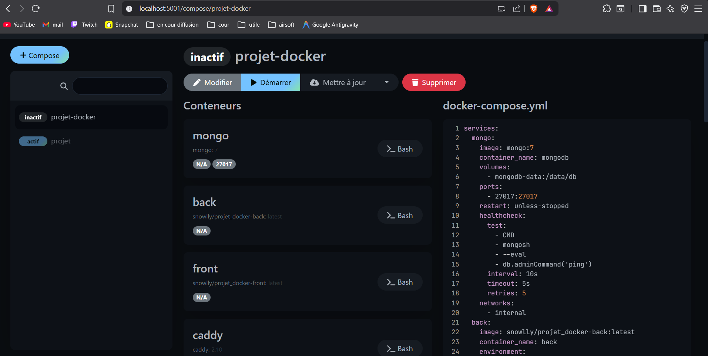

# Site bande annonce film

> **MEMBRES DU GROUPE :**
> - **BLAIN Antoine**
> - **PECONTAL Corentin** 
> - **MARTIN Evan**

---

## 1. Présentation du Projet
Dans ce projet, nous allons créer un site très basique dédié aux bandes-annonces de films. L’objectif principal est de mettre en place un CRUD (Créer, Lire, Mettre à jour, Supprimer) pour gérer facilement les films et leurs bandes-annonces.

**Fonctionnalités principales :**
* Afficher des trailers (Image Thumbnail, Titre, Date de publication, synopsis, Btn regarder avec le lien YT)
* Ajouter des trailers
* Modifier les trailers
* Suppression des trailers en cascade 
* barre de recherche (type AJAX si on a le temps)

**Techno utilise :**
* nodes JS 
* google doc 
* mangoDB
* discord 
* GitHub et Git
* Caddy 
* Dockge
* Cloudflare
* Minikube

## 2. Architecture Technique

### Schéma d'infrastructure


## 3. Guide d'installation
Pour lancer le projet localement :

1.  Cloner le dépôt :
    ```bash
    git clone [https://github.com/RAYWINN43/Projet_DOCKER.git](https://github.com/RAYWINN43/Projet_DOCKER.git)
    cd PROJET
    ```

2.  Lancer la stack :
    ```bash
    docker compose pull
    docker network create public
    docker network create private
    docker compose up -d
    ```

3.  lancer la BDD et ajout d'une base test
    ```bash
    cd netnet 
    npm run clear
    npm run seed
    npm start
    ```


4. Accéder aux services :
    * Web : `http://netnet.localhost/`

## 4. Méthodologie & Transparence IA

### Organisation
Evan partie Back + cloudflare
Antoine partie DOCKGE + DOCKFILE + README + planteuml
Corentin partie Front + Debug + connection front et back

### Utilisation de l'IA
* **Outils utilisés :** (ChatGPT 5.2,Github Copilot)
* **Usage :**
    * *aide BDD:* nous a donnée des commande CURL pour verrifier le bon fonctionnement de la BDD 
    * *GIT :* aide avec les commande GIT (pour travailler a plusieur + 2,3 bug branch)
    * *Front :* aide pour du CSS (vibe)
    * *Debug:* aide pour debug en tout genre (contenaire ne voulant pas ce lancer, probleme dockge)

## 5. Difficultés rencontrées & Solutions
* *GITHUB :* des merge qui ne voulez pas se faire car les branche etait distant
* *Solution :* commande git pour regler ce probleme 

* *CADDY :* l'affichage marche via le port mais pas via caddy front.localhost
* *Solution :* changement dans dockercompose + caddy file

* *Dockge :* n'arriver pas voir le dockercompose 
* *Solution :* changement de chemin dans le dockercompose

* *Cloudflare :* erreur 502 
* *Solution :* aller voir le professeur

## 6. SCREENSHOOT
home PAGE : 
details PAGE : 
update PAGE : 
dockge PAGE : 
